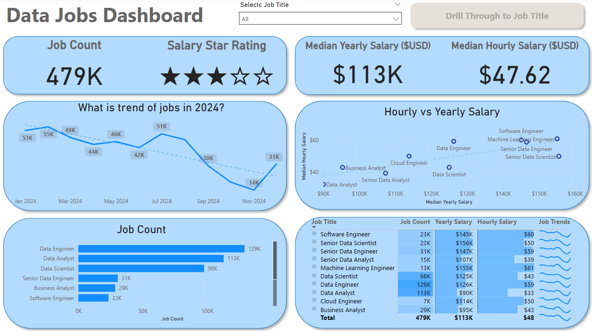
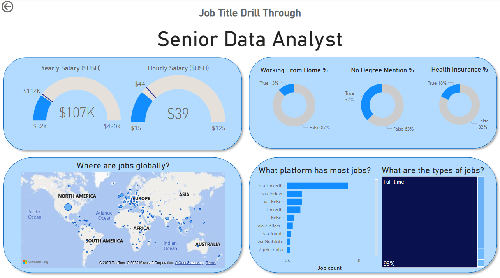

# 📊 Data Jobs Dashboard — Power BI Project

This dashboard is built following the [Power BI for Data Analytics - Full Course for Beginners](https://www.youtube.com/watch?v=FwjaHCVNBWA&t=12882s) by Luke Barousse.

## 🔍 About

Designed for those exploring the data job market—whether job seekers, career changers, or data enthusiasts—this dashboard organizes 2024 data science job postings into a clear, interactive report. It helps you uncover trends, salaries, locations, and hiring details all in one place.

## 📁 Dashboard File

The Power BI report file is here: `Data_Jobs_Dashboard.pbix`

## ✨ Key Features

* ⚙️ Data cleaning and shaping with Power Query: fix blanks, adjust data types, add columns
* 🧮 Calculated measures for median salaries and job counts
* 📈 Visualizations including bar, column, line, area, and map charts
* 🖱️ Interactive elements: slicers for job titles, buttons and bookmarks for easy navigation, drill-through pages for detailed insights
* 🎨 Well-organized layout blending familiar and creative visuals

## 🗂️ Pages Overview

### 1. 📊 Market Summary

An overview of the data job market showing total job counts, median salaries, and the most popular job titles. This page gives a quick snapshot of overall trends and market health.

### 2. 🔎 Job Details Drill-Through

A detailed page accessed by drilling through on a specific job title. Here, you’ll find salary ranges, remote work statistics, leading hiring platforms, and a map showing job locations worldwide.

## 🎯 Purpose

A learning project to apply Power BI skills by replicating a comprehensive dashboard from a beginner course, aimed at providing practical insights into the data jobs landscape.

